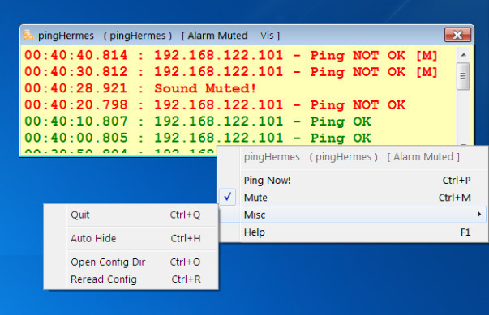

# pingHermes
A utility to check if a PC is alive, using **ping**.

## Intro

Having a remote PC running unattended is always a point of worry for any administrator.

To counter this, here comes a utility that will **ping** any PC (given its IP), and report back its state, providing both a visual and a audio report.

The program is called **pingHermes** (from the hostname of the first system this application was tested on).

When executed, it will remain in the system tray and silently ping the target PC, until it does not get a ping reply. Then, it will show its window and start playing an alarm sound.




## Installation

The program comes in the form of an executable file (EXE on Windows), which is all that's necessary for its execution.

Just place the executable file in a directory and execute it; all needed files are contained within the executable and will be extracted as needed.

Then, just click on its system icon and select **Help** to get more info about the way to configure it.


## Building from source

Although this project was originally supposed to be used on Windows, it can be compiled and used under Linux, MacOS and the BSDs.

In order to build the project from source, you need the following:

1. [Lazarus](https://www.lazarus-ide.org/index.php?page=downloads) \
   If you are on Linux, your distro will probably have a package you can install.
2. [TRichMemo](https://wiki.freepascal.org/RichMemo) installed within **Lazarus**. \
   More on this later on.
3. Download the source (the zip file will do just right), extract it and fire up **Lazarus**, load the project and build it. \
   You will end up with an executable (*pingHermes.exe* on Windows, or *pingHermes* on any other platform). \
   You are done!

The sources contain the followin third party libs:
1. [Synapse](https://wiki.freepascal.org/Synapse), which provides an easy to use serial port and synchronous TCP/IP library.
2. A modified version of [TPlaySound](https://wiki.lazarus.freepascal.org/TPlaySound), a component to play WAV files in Windows and Linux.

### TRichMemo Installation

1. First of all fire up **Lazarus** with elevated rights. \
   If you are on Windows and you are not the administrator, run it as Administrator. \
   If you are on any other platfrom, use `sudo lazarus` (or `sudo lazarus-ide`, depending on your distro).
2. Go to **Package** \ **Online Package Manager...**.
3. Search for **rich**. \
   You will get a list of packages, check the one called **RichMemo** and the click on **Install**.
4. Click on **Yes** when asked to rebuild the IDE.
5. When **Lazarus** restarts, just close it and you are done.
6. Open **Lazarus** as a normal user and you are ready to biuld **pingHermes**.

### Other platforms
On any platform other than Windows, the program must be given special rights in order to be able to **ping** a remote PC.

This is because ping uses raw sockets, and this is not permitted to a normal process.

On Linux, after you "install" the executable to its final location, you will have to execute:

```
sudo setcap 'cap_net_raw=ep' /path/to/pingHermes
```

Then you are ready to use it.

On the BSDs and MacOS, you will have to run it as root, or use setuid.


